class: center, middle

# UCLA Library Data Science Center  
.center[##### *Doing Data since 1961*]  

[[Slides: https://ucla-data-archive.netlify.com/slides/mass_2018/#1](https://ucla-data-archive.netlify.com/slides/mass_2018/#1)]
---

## Today's Topics

* UCLA Library Data Science Center: who we are and what we do
* How to search for and access data for research
* Resources, tools and support available to students at UCLA
* Publishing and Data Management Plans

---

## UCLA Library Data Science Center
#### 21536 Charles E. Young Research Library (YRL)
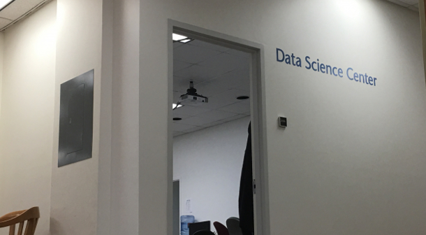

##### [[https://www.library.ucla.edu/location/data-science-center](https://www.library.ucla.edu/location/data-science-center)]

---
## Data Life Cycle

The Data Science Center provides services that are tied to the data life-cycle.

###### *"Data archiving is a process, not an end state where data is simply turned over to a repository at the conclusion of a study. Rather, data archiving should begin early in a project and incorporate a schedule for depositing products over the course of a project’s life cycle and for the creation and preservation of accurate metadata, ensuring the usability of the research data itself. Such practices would incorporate archiving as part of the research method.”  Preserving Research Data, Jacobs and Humphrey (2004)*

##### [illustration: DatOne Data Life Cycle](https://www.dataone.org/data-life-cycle)

---
## Data Science Center: Our Services and the Data Life Cycle

### Plan
* Review data sources
* Help investigate archiving issues, costs, consent and disclosure risks
* Create a data management plan

### Collect/Assure
* Project management and file organization
* Quality Assurance for collected data and acquisition workflows
* Consultation on restricted data access and security

### Describe
* Assist with filenames, standard terminology and data dictionaries
* Document analysis and file manipulations
* Help identify appropriate standards

---
## Data Science Center: Our Services and the Data Life Cycle

### Preserve
* Help with backing up your Data
* Help with deciding what data to preserve
* Choosing stable file formats
* Help identifying suitable repositories

### Integration
* Consider compatability
* Document steps
* Capture the provenance of sources

### Analysis
* Help identify appropriate sofware
* Consultation on coding best practices

---

## Data Science Center: Our Services and Software

* Reference: finding and using data.  
* Data Management Plans  
* Metadata  

* Provide training: [Software/Library carpentry](https://software-carpentry.org/) / [Software Carpentry R-language](https://www.library.ucla.edu/events/software-carpentry-workshop-r-version)   

* Host events and lectures: [Data Archive News and Upcoming Events](https://www.library.ucla.edu/location/social-science-data-archive)

* Statistical Consulting:
  * [Data Science Center Statistical Consultant](https://www.library.ucla.edu/location/data-science-center/our-team)
  * Refer to [UCLA Statistics Consulting Center](http://scc.stat.ucla.edu/)
  
---

## Search Strategies and Defining Your Research  

* General to specific; broad to narrow
* Names of investigators; names of studies
* Studies described in literature, news and websites   

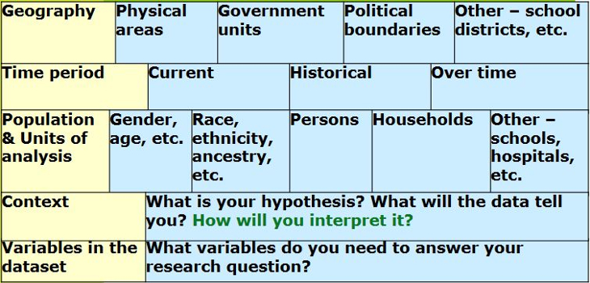    
_Libbie Stephenson_

---

## Finding and Using Data

  * Data available with UCLA Affiliation  
  * Data that is publically available
  * Restricted data
  
  * Quantitative data
  * Qualitative data
 
---

## Finding and Using Data

### Data available with UCLA _Affiliation_   
  * ICPSR/University of Michigan: [http://www.icpsr.umich.edu/icpsrweb/ICPSR/](http://www.icpsr.umich.edu/icpsrweb/ICPSR/)
  * Pew Research Center: [http://www.pewresearch.org/](http://www.pewresearch.org/)  
  * IPUMS (Integrated Public Use Microdata Series): [https://www.ipums.org/](https://www.ipums.org/)
  * Roper Center/Cornell University: [https://ropercenter.cornell.edu/](https://ropercenter.cornell.edu/)  
  * UCLA Social Science Data Archive Catalog: [https://dataverse.harvard.edu/dataverse/ssda_ucla](https://dataverse.harvard.edu/dataverse/ssda_ucla)

---

## Finding and Using Data

### Data that is publically available    
  * ICPSR: [https://www.icpsr.umich.edu/icpsrweb/](https://www.icpsr.umich.edu/icpsrweb/)
  * Los Angeles County Health Survey: [http://www.publichealth.lacounty.gov/ha/hasurveyintro.htm](http://www.publichealth.lacounty.gov/ha/hasurveyintro.htm)
  * UCLA Social Science Data Archive Catalog: [https://dataverse.harvard.edu/dataverse/ssda_ucla](https://dataverse.harvard.edu/dataverse/ssda_ucla)
  * Government Sites, Census Data:   [https://www.census.gov/](https://www.census.gov/)
  * Public Policy Institute of CA: [http://www.ppic.org/](http://www.ppic.org/)  

---
 

## Finding and Using Data

### Data is restricted:   
* requiring permission to use - apply to use
* or physical restrictions - where it can be used

 * ICPSR: [https://www.icpsr.umich.edu/icpsrweb/](https://www.icpsr.umich.edu/icpsrweb/)  
 * Los Angeles County Health Survey: [http://www.publichealth.lacounty.gov/ha/hasurveyintro.htm](http://www.publichealth.lacounty.gov/ha/hasurveyintro.htm)

---

## Finding and Using Data  

### Qualitative Data  
 * ICPSR: [http://www.icpsr.umich.edu/icpsrweb/ICPSR/](http://www.icpsr.umich.edu/icpsrweb/ICPSR/)  
 *  Qualitative Data Repository/Syracuse University: [hhttps://qdr.syr.edu/](https://qdr.syr.edu/)   

---
 
## More Data Sources  

* ICPSR: [http://www.icpsr.umich.edu/icpsrweb/ICPSR/](http://www.icpsr.umich.edu/icpsrweb/ICPSR/)
* UCLA Library Social Science Data Archive Catalog: [https://dataverse.harvard.edu/dataverse/ssda_ucla](https://dataverse.harvard.edu/dataverse/ssda_ucla)
* UCLA Library DataDen: [https://dataden.library.ucla.edu/jspui/](https://dataden.library.ucla.edu/jspui/)
* Government Sites, Census Data:   [https://www.census.gov/](https://www.census.gov/)
* IPUMS (Integrated Public Use Microdata Series): [https://www.ipums.org/](https://www.ipums.org/)
* Public Policy Institute of CA: [http://www.ppic.org/](http://www.ppic.org/)
* NBER (National Bureau of Economic Research): [http://www.nber.org/data/](http://www.nber.org/data/)
* CDC/NCHS (Centers for Disease Control and Prevention/National Center for Health Statistics): [https://www.cdc.gov/nchs/surveys.htm](https://www.cdc.gov/nchs/surveys.htm)
* Pew Research Center: [http://www.pewresearch.org/](http://www.pewresearch.org/)
* Data.gov: [https://www.data.gov/](https://www.data.gov/)
* World Health Organization: [http://www.who.int/healthinfo/statistics/en/](http://www.who.int/healthinfo/statistics/en/)
* International Monetary Fund: [http://www.imf.org/en/Data](http://www.imf.org/en/Data)
* Harvard Dataverse: [hhttps://dataverse.harvard.edu/](https://dataverse.harvard.edu/)

---

## How do I know this study useful?

* Raw data are __not__ eye-readable
* To decipher data you will use __Questionnaires and Codebooks__

  

---

## What is a Questionnaire?  

* A __questionnaire__ is a _research instrument_ consisting of a series of _questions_ and other prompts for the purpose of gathering information from respondents.  

* Questionnaires cover separate topics such as:
	* Preferences (e.g. political party)
    * Behaviors (e.g. food consumption)
    * Facts (e.g. gender)

* Questionnaires can include indexes or scales:
	* Latent traits (e.g. personality traits)
    * Attitudes (e.g. towards immigration)
    * An index (e.g. Social Economic Status)

---

## Questionnaire: ABC New Poll
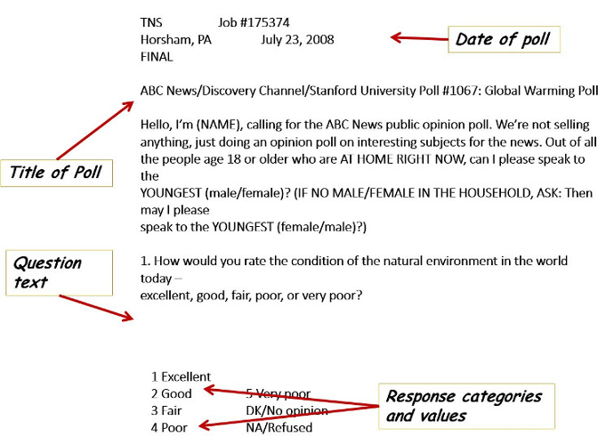  

---

## What is a Codebook?

* An overview of the study or dataset
* Variable names and descriptions
* Column locations (mostly this is for raw data)

### May also include:
* Test of questions if the data comes from a survey
* Example of the Questionnaire
* Detail on who responded to the survey

---

## Codebook: General Social Survey
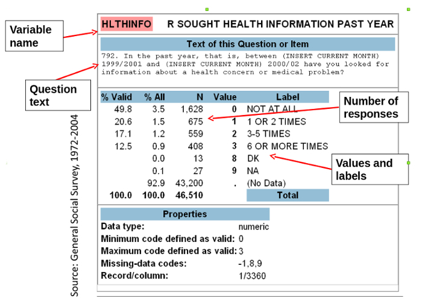  

---

## Codebook and Raw Data
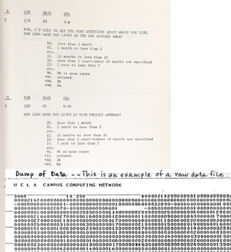  

---

## ICPSR Data Site  
#### Inter-university Consortium for Political and Social Research [http://www.icpsr.umich.edu](http://www.icpsr.umich.edu)  
  

---

## ICPSR: Find Data
[http://www.icpsr.umich.edu/icpsrweb/ICPSR](http://www.icpsr.umich.edu/icpsrweb/ICPSR)  
  

---

## ICPSR: Register to Access Data
(ORCID Identifier: [https://orcid.org/](https://orcid.org/))

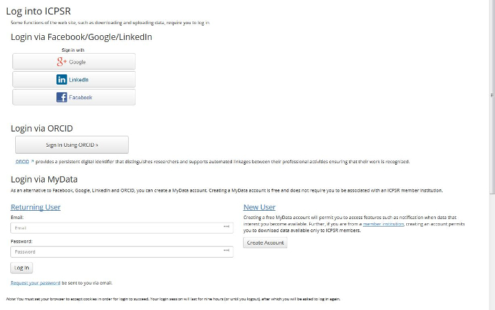

---

## ICPSR: Search by Topics

---

## ICPSR: Search for and Compare Variables

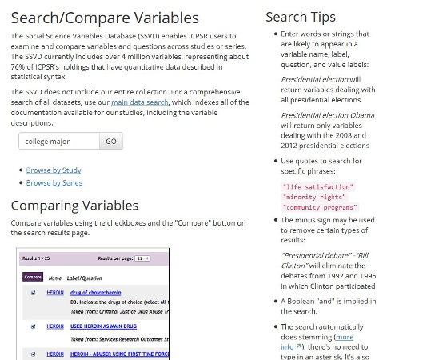

--- 

## ICPSR: Compare Variables

 
---

## ICPSR: Study Page and Data

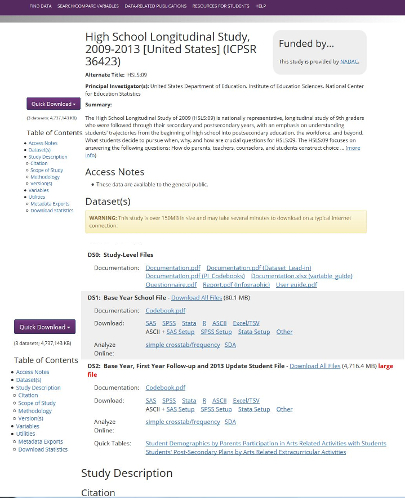  

 
---

## ICPSR: Reading About Data

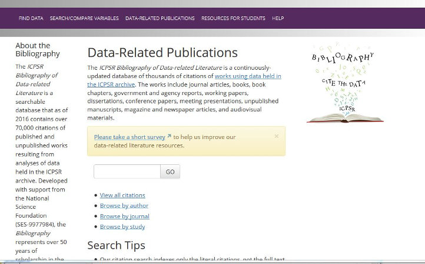 

 
---

## ICPSR: Publications linked to Data

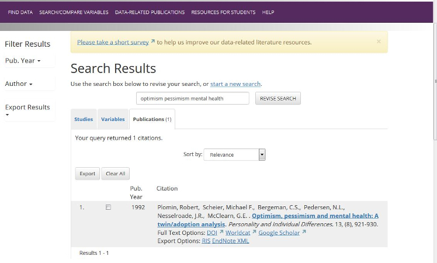  

 
---

## ICPSR: Publications Linked to Data

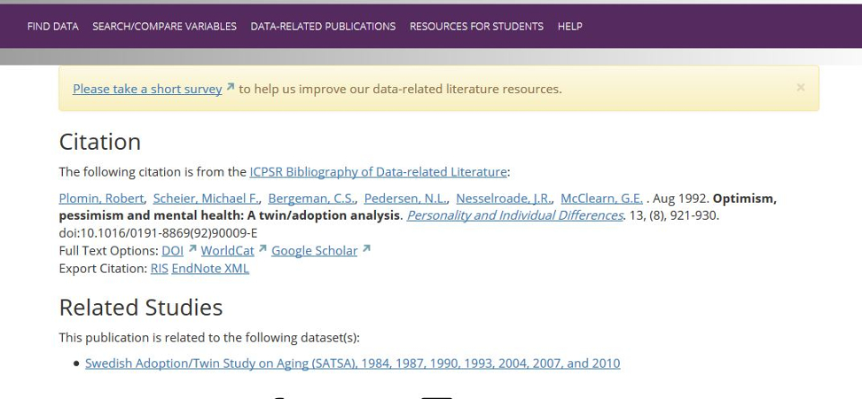
 
---

# Data Management Plans

* What is a Data Management Plans
* Why do I need this?
* What tools are available to help?

---

## What is a Data Management Plan?

A data management plan is a document that describes what you will do with your data _during_ your research and _after_ you complete your research.

---

## Why do you need this?

* Funding Agencies
* Publishing  [https://dataden.library.ucla.edu/jspui/](https://dataden.library.ucla.edu/jspui/)  ORCID:[https://orcid.org/](https://orcid.org/)
* Sharing and Archiving Data
* Regardless of the requirements, good data management is an essential skill for researchers.

---

## Questions?  

