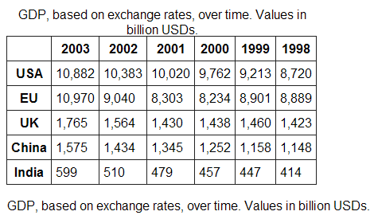

name: inverse
layout: true
class: center, middle, inverse
---
# Data Basics

### Leigh Phan <leighphan@g.ucla.edu> & Tim Dennis <timdennis@ucla.edu>

---
layout: false
.left-column[
## What is Data?

]
.right-column[
**da·ta noun plural but singular or plural in construction, often attributive \ˈdā-tə, ˈda- also ˈdä-\**
1. factual information (as measurements or statistics) used as a basis for reasoning, discussion, or calculation
2.  information output by a sensing device or organ that includes both useful and irrelevant or redundant information and must be processed to be meaningful
3.  information in numerical form
that can be digitally transmitted or processed

>Merriam-Webster (http://www.merriam-webster.com/dictionary/data)
]
---

.left-column[
## Data can be
]
.right-column[
* **Observational**: Captured in real-time, typically outside the lab
  * Examples: Sensor readings, survey results, images, audio, video
* **Experimental**: Typically generated in the lab or under controlled conditions
  * Examples: test results
* **Simulation**: Machine generated from test models
  * Examples: climate models, economic models
* **Derived /Compiled**: Generated from existing datasets
  * Examples: text-as-data (text mining), compiled database, 3D models
]
---

.left-column[
## Data can be
]
.right-column[
* **Text**: field or laboratory notes, survey responses, interview transcripts, focus groups
  * Numeric: tables, counts, measurements
* **Audiovisual**: images, sound recordings, video
  * Models, computer code, geospatial data
* **Discipline-specific**: FITS in astronomy, CIF in chemistry
* **Instrument-specific**: equipment outputs
]
---
.left-column[
## Microdata
]
.right-column[
* Data directly observed or collected from a specific unit of observation.
* Contain individual cases, usually individual people, or in the case of Census data, individuals & households
* Examples:
  * Census: the unit of observation is probably an individual, a household or a family.
  * Survey or poll: the responses of a single respondent

]
---
.left-column[
## Aggregate or Summary Data
]
.right-column[
* Is higher-level data that have been compiled from smaller units of data.
  * Examples: inflation rate, consumer price index, demographic data for city or state

]
---
.left-column[
##Datasets
]
.right-column[
A dataset or study is made up of the raw data file and any related files, usually the **codebook** and **setup files**.
Most data sets require at least basic statistical analysis (Stata, SPSS, R, etc.) or spreadsheet programs (Excel) to use.
]
---
.left-column[
## Recap
]
.right-column[
* Data are **raw ingredients** from which statistics are created.
* Statistical analysis can be performed on data to show relationships among the variables collected.
* Through secondary data analysis, many different researchers can re-use the same data set for different purposes.
]

---
name: inverse
layout: true
class: center, middle, inverse
---

# Collecting Data

---
layout: false

.left-column[
## Who would collect the data?
]
.right-column[
1. Could it have been collected by a government agency?
2. A nonprofit or nongovernmental organization?
3. A private business or industry group?
4. Academic researchers, i.e. you?
]

---
.left-column[
## Publications
]
.right-column[
## Look for publications that use the kind of data you’re looking for and that cite the dataset

* In other words, is the data you want mentioned in scholarly articles or government reports or some other source?
* [ICPSR (Inter-university Consortium for Political and Social Research) Data-Related Publications Search](https://www.icpsr.umich.edu/icpsrweb/ICPSR/citations/index.jsp) - Database of publications that use ICPSR data.
]

---
.left-column[
## Using Data
]
.right-column[
## What kind of analysis do you want to perform?
* Preparing data for analysis is often 60-80% of work
* Are you using a statistical software tool?
  - R, Stata, Python, Excel?
  - Some repositories provide setup files & clean data for specific programs
- Are more interested in qualitative methods?
  - Text analysis, text classification, interviews, ethnographies
]
---
.left-column[
## Identify Variables & Your Research Problem
]
.right-column[
### What aspects of your topic are you interested in?
* It's often helpful to think in terms of variables when looking for data.
  * The effects of **educational attainment** on **income**.
* Factoring in geographies and time components can also help narrow down sources
]
---
.left-column[
##Find/collect data
]
.right-column[
## Once you know that what you want exists, it's time to hunt it down

* Is it freely available on the web?
* Or part of a package to which the library already subscribes?
* Can it be requested directly from the researcher?
* Will you need to interview or survey people?
]

---
.left-column[
##Some Data Resources
]
.right-column[
### Finding Data & Statistics

**These can also be used as finding aids**

List of data resources to which the library subscribes
* Data Planet - <http://statisticaldatasets.data-planet.com/dataplanet> - Datasets from over 70 sources in many subjects
* Statistical Insight - <http://uclibs.org/PID/51367>
* Simply Map <http://www.simplymap.com/> - allows users to create maps and reports using demographic, business, and marketing data.
* Social Explorer <http://www.socialexplorer.com/> - combines data from the U.S. Census of Population and Housing & the American Community Survey (ACS) with a user friendly interface, allowing the creation of maps & statistical table
]
---
.left-column[
##Microdata Sources
]
.right-column[

* IPUMS (Integrated Public Use Microdata Series) <https://usa.ipums.org/usa/>
   * Harmonized historic samples from:
       * US Census
       * International Countries Censuses
       * Current Population Survey
* ICPSR <http://www.icpsr.umich.edu/icpsrweb/landing.jsp>
   * variable level searching, publications searching, topical index
   * Over 9000 studies available for download in statistical packages formats (SAS, SPSS, Stata, R)
* Roper <http://ropercenter.cornell.edu/> - Public opinion polls
* Many repositories <https://www.re3data.org/>
]
---
#Using data

* Data can come in many formats (xls, csv, txt, etc.)
* Data from resources above can also come with setup files and codebooks
*
---
.left-column[
## Data sharing and publishing   
]
.right-column[
* Funding agencies and journals are increasingly requiring researchers to share their data
*
* A data repository is a collection of datasets that have been deposited for storage and findability.
* They are often discipline specific and/or affiliated with a research institution

### Examples
* [ICPSR](http://www.icpsr.umich.edu/icpsrweb/)
* [Harvard Dataverse Network](https://dataverse.harvard.edu/)
* [Roper Center](https://ropercenter.cornell.edu/)
* [Zenodo](https://zenodo.org/)
* Many others: <https://www.re3data.org/> lists over **2,000**
]
---
.left-column[
##We Provide Consulting On:
]
.right-column[

* Finding data
* Data cleaning and preparation
* File format conversion
* Statistical software support/instruction (Stata, R, Python)
* Geospatial data/analysis
* Writing scripts (screen scrapers, munging)
* Methodological/Stats/Modeling data
* Reproducible Research Workflows
* Best practices on data management
]

---

.left-column[
##Contact:
]
.right-column[

* Tim Dennis <mailto:timdennis@ucla.edu>
* Leigh Phan <mailto:leighphan@library.ucla.edu>
* Data Archive: <https://www.library.ucla.edu/location/social-science-data-archive>
* Workshops: <https://ucla-data-archive.netlify.com/>
* These slides:
]
