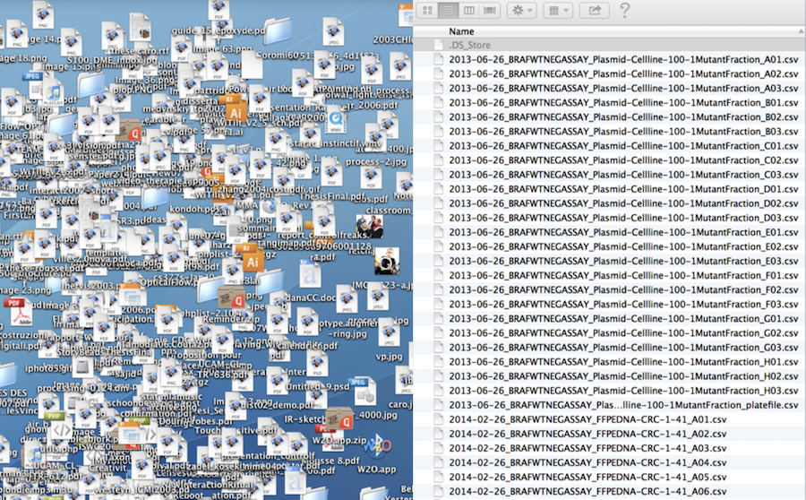
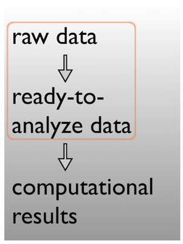
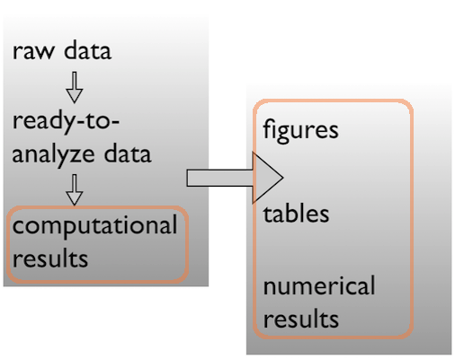
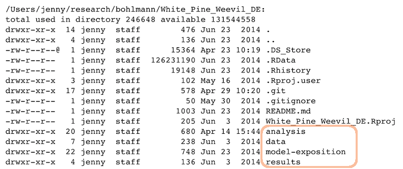

```{r setup, include=FALSE}
library(knitr)
opts_chunk$set(echo = TRUE, fig.align = "center")
options(htmltools.dir.version = FALSE)
```

>*A place for everything, everything in its place* - Benjamin Franklin

---

```{r, out.width = "500px", echo = FALSE}
include_graphics("../fig/beer_messy_tidy.png")
```

```{r, out.width = "500px", echo = FALSE}

```

---

### Data analysis workflow

```{r, out.width = "500px", echo = FALSE}
include_graphics("../fig/workflow.png")
```

???
#### Slide 2
1. Data, we are inundated, and there's more every day.
2. We may be experiencing more data than we know how to work with effectively, reproducibly.
* Opportunity to bring in any current topic or relevant news items.
---

#### Face it...

- There are going to be files
- LOTS of files
- The files will change over time
- The files will have relationships to each other
- It'll probably get complicated

???
1. With the advent of personal computing, old limits for how to name and organize directories are gone.
* No limit anymore to 8.3 file-naming, for example.
2. This makes it easier in some ways. We can name and organize directories and files anyway that we want to.
3. But, for sharing data, and writing scripts that evaluate (or analyze) data in files automatically, files need to be
    structured, organized, and methodically named.
4. They also need to be organized and structured -- for one's mental sanity, and of course -- reproducibility!
  1. This process can take some forethought
    * either because you are lucky enough to be starting from scratch OR
    * because you are trying to standardize an existing set of data files.
---

#### Mighty weapon

- File organization and naming is a mighty weapon against chaos
- Make a file's name and location VERY INFORMATIVE about what it is, why it exists, how it relates to other things
- The more things are self-explanatory, the better
- `READMEs` are great, but don't document something if you could just make that thing self-documenting by definition

---

### Organizing your data analysis workflow

#### Raw data $\rightarrow$ data

Pick a strategy, any strategy, just pick one and *stick to it*!

```{r, out.width = "200px", echo = FALSE}

```

???
1. Consider the data-life-cycle. To conceptualize this, think of **inputs** (your raw data), and **outputs.**
2. Your data life cycle can help you figure out how to store your raw data, your iterative analyses, and output like posters, manuscripts, and reports in a way that helps you keep track, now-and-in-the-future.
---

#### Data $\rightarrow$ results

Pick a strategy, any strategy, just pick one and *stick to it*!

```{r, out.width = "400px", echo = FALSE}
include_graphics("../fig/workflow_data_to_results_1.png")
```
???
1. No matter what you do, decide what to do and stick-to-it. Be consistent.
  * Optional - may be a good place in-the-future, to modify the slide to contain something to show where you would keep a file that lists what you've done, what steps you've taken, to clean your data.
---

#### Data $\rightarrow$ results

Pick a strategy, any strategy, just pick one and *stick to it*!

```{r, out.width = "400px", echo = FALSE}

```

---

### A real (and imperfect!) example

```{r, out.width = "600px", echo = FALSE}

```

???
1. Example directory structure.

---

#### Data

Ready to analyze data:

```{r, out.width = "700px", echo = FALSE}
include_graphics("../fig/sample_ready_to_analyze_data.png")
```

---

Raw data:

```{r, out.width = "700px", echo = FALSE}
include_graphics("../fig/sample_raw_data.png")
```

---

#### Analysis and figures

`R` scripts + the `Markdown` files from "Compile Notebook":

```{r, out.width = "700px", echo = FALSE}
include_graphics("../fig/sample_ready_to_analyze_data.png")
```

---
The figures created in those `R` scripts and linked in those `Markdown` files:

```{r, out.width = "700px", echo = FALSE}
include_graphics("../fig/sample_raw_data.png")
```

---

#### Scripts
Linear progression of `R` scripts, and `Makefile` to run the entire analysis:

```{r, out.width = "700px", echo = FALSE}
include_graphics("../fig/sample_scripts.png")
```

---

#### Results

Tab-delimited files with one row per gene of parameter estimates, test statistics, etc.:

```{r, out.width = "600px", echo = FALSE}
include_graphics("../fig/sample_results.png")
```

---

#### Expository files

Files to help collaborators understand the model we fit: some markdown docs, a Keynote presentation, Keynote slides exported as PNGs for viewability on GitHub:

```{r, out.width = "700px", echo = FALSE}
include_graphics("../fig/sample_expository.png")
```

---

#### Caveats / problems with this example

- This project is no where near done, i.e. no manuscript or publication-ready figs.
- File naming has inconsistencies due to three different people being involved.
- Code and reports/figures all sit together because it’s just much easier that way w/ `knitr` & `RMarkdown`.

???
1. Challenges you will face - known issues to be aware of when organizing data and downstream derived files.
---

#### Wins of this example

- I can walk away from the project and come back to it a year later and resume work fairly quickly
- The two other people (the post-doc whose project it is + the bioinformatician for that lab) were able to figure out what I did and decide which files they needed to look at, etc.

GOOD ENOUGH!

???
1. Why should you bother standardizing your research workflow? What will you get for your organizational efforts?
2. It's time well-spent, but there is a point of *good enough.*

---

### Other tips

#### Tips: the `from_joe` directory

- Let's say my collaborator and data producer is Joe.
- He will send me data with weird space-containing file names, data in Microsoft Excel workbooks, etc.
- It is futile to fight this, just quarantine all the crazy here. I rename things and/or export to plain text and put those files in my data directory.
- Whether I move, copy, or symlink depends on the situation.
- Whatever I did gets recorded in a `README` or in comments in my `R` code -- whatever makes it easiest for me to remind myself of a file's provenance, if it came from the outside world in a state that was not ready for programmatic analysis.

???
1. Another hint: **quarantine the crazy**. What?
2. Create a space to put files and data with known issues.
3. Create a README file or some other notes or code comments that track your changes to this messy data.
---

#### Tip: give yourself less rope

- I often revoke my own write permission to the raw data file.
- Then I can't accidentally edit it.
- It also makes it harder to do manual edits in a moment of weakness, when you know you should just add a line to your data cleaning script.

???
1. Learn how to revoke your write permissions to the '''raw''' data files.
  - this prevents the creation of very sad data stories.
  - remember there often is no "un-delete" so put measures into place to keep the nightmares away.
  - (we are assuming here, that everyone knows how to do this, and understands *write permissions*).
---


#### Tip: prose

- Sometimes you need a place to park key emails, internal documentation and explanations, random Word and PowerPoint docs people send, etc.
- This is kind of like `from_joe`, where I don’t force myself to keep same standards with respect to file names and open formats.

---

#### Tip: life cycle of data

Here’s how most data analyses go down in reality:
- You get raw data
- You explore, describe and visualize it
- You diagnose what this data needs to become useful
- You fix, clean, marshal the data into ready-to-analyze form
- You visualize it some more
- You fit a model or whatever and write lots of numerical results to file
- You make prettier tables and many figures based on the data & results accumulated by this point
- Both the data file(s) and the code/scripts that acts on them reflect this progression

???
1. Review of the Data Analyses Life Cycle.
---

#### Prepare data $\rightarrow$ Do stats $\rightarrow$ Make tables & figs

The `R` scripts:

```
01_marshal-data.r
02_pre-dea-filtering.r
03_dea-with-limma-voom.r
04_explore-dea-results.r
90_limma-model-term-name-fiasco.r
```

The figures left behind:

```
02_pre-dea-filtering-preDE-filtering.png
03-dea-with-limma-voom-voom-plot.png
04_explore-dea-results-focus-term-adjusted-p-values1.png
04_explore-dea-results-focus-term-adjusted-p-values2.png
...
90_limma-model-term-name-fiasco-first-voom.png
90_limma-model-term-name-fiasco-second-voom.png
```

---

### Recap

File organization should reflect inputs vs outputs and the flow of information

```
/Users/jenny/research/bohlmann/White_Pine_Weevil_DE:
drwxr-xr-x  20 jenny  staff        680 Apr 14 15:44 analysis
drwxr-xr-x   7 jenny  staff        238 Jun  3  2014 data
drwxr-xr-x  22 jenny  staff        748 Jun 23  2014 model-exposition
drwxr-xr-x   4 jenny  staff        136 Jun  3  2014 results
```

```{r, out.width = "500px", echo = FALSE}
include_graphics("../fig/workflow.png")
```
???
Tips for instructors:

- Remind them that they need to document as they go -- in past workshops most people got hung up on doing, then documenting, and then the second part of the exercises didn't have as much of a punch. More important that they document what they do (even if not all tasks) than that they finish.