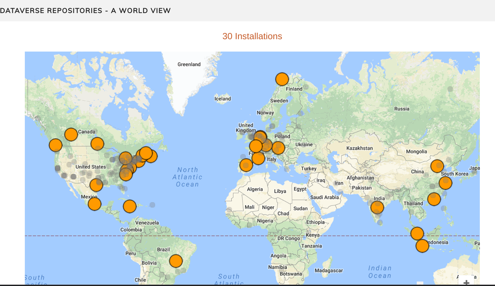

```{r setup, include=FALSE}
options(htmltools.dir.version = FALSE)
```

## Library Data Archive 

* [Workshops](https://www.library.ucla.edu/location/social-science-data-archive) (Data Analysis, R, Python, Open Refine, Data Management)
* [Consultations](https://www.library.ucla.edu/location/social-science-data-archive) (Research with data, data analysis, coding, project and data mgmt, data publishing and archiving)
   * Tim <http://calendly.com/timdennis> (Data Discovery, Open Science, GIT, Python, R, SQL, Stata)
   * Jamie <http://calendly.com/jamiejamison> (Data Discovery, Data Management, Git, Python, SQL, SPSS)
   * Contact us: <ucla-data-archive@googlegroups.com>

---
## Data Den 

???
* Live, but currently collection deposits are mediated by the Data Archive (contact us)
* Early days only a few collections
* A general data publishing platform
* Gigascale in size scope 

---

## Collection page 

[](https://dataden.library.ucla.edu/jspui/)

???
* Only a handful of collections now
* 

---
## Joining the Dataverse Network



???
* Need for more modular approach (Data Archives collection, Data Den, Restricted Data, Departments)
* Dataverse designed to be modular - subdataverses can be branded, have admins and curators, keep up with scholarly com ecosystem (orcid)
* Thoughtful design to anticipate research innovation, object storage, big files 
* Solid API with Python and R clients 
* Integration with tools like Open Science Framework
* Network facilitates switching institutions 

---
## Open Science Framework


???
* Center for Open Science (COS) is a non-profit technology startup founded in 2013 with a mission to increase openness, integrity, and reproducibility of scientific research
* Open Scienc Framework - free, open source web app. that supports and connects research workflow
* Collaboration tool, connects with githbub, Box, zotero, drive
* Can pre-register research project
* can publish project and get DOIs 

---
## Book on Reproducible Research (CaseS Studies)


URL: <https://www.gitbook.com/book/bids/the-practice-of-reproducible-research/details>

--- 

## Library Data Archive 

* [Workshops](https://www.library.ucla.edu/location/social-science-data-archive) (Data Analysis, R, Python, Open Refine, Data Management)
* [Consultations](https://www.library.ucla.edu/location/social-science-data-archive) (Research with data, data analysis, coding, project and data mgmt, data publishing and archiving)
   * Tim <http://calendly.com/timdennis> (Data Discovery, Open Science, GIT, Python, R, SQL, Stata)
   * Jamie <http://calendly.com/jamiejamison> (Data Discovery, Data Management, Git, Python, SQL, SPSS)
   * Contact us: <ucla-data-archive@googlegroups.com>

---
class: inverse, center, middle

# Thanks!

### Contact us: <ucla-data-archive@googlegroups.com>
